# grove - Architecture

This document describes the system architecture, domain model, and component
relationships at the conceptual level. It is intentionally
language-agnostic — the implementation document specifies concrete types and
file layouts.

## 1. System Overview

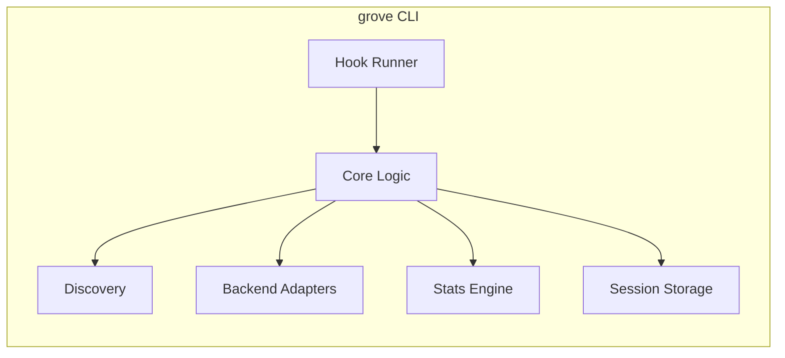

| Layer | Responsibilities |
|-------|------------------|
| **Hook Runner** | Receives hook events from Claude Code, dispatches to core |
| **Core Logic** | Gate state machine, reflection orchestration, write gate filter |
| **Discovery** | Ticketing system and memory backend auto-detection |
| **Backend Adapters** | Uniform interface over built-in markdown and Total Recall |
| **Stats Engine** | Usage tracking, decay evaluation, retrieval scoring, insights |
| **Session Storage** | Per-session state persistence |

## 2. Logical Modules

| Module | Responsibility |
|--------|----------------|
| **Gate** | State machine governing when reflection is required |
| **Reflection** | Parsing structured reflection output, applying write gate filter |
| **Learning** | Learning entity: categories, scope, lifecycle |
| **Ticket Discovery** | Detecting which ticketing system is active |
| **Backend Discovery** | Detecting which memory backends are available |
| **Backend: Markdown** | Built-in append-only file storage |
| **Backend: Total Recall** | Adapter routing through Total Recall's commands |
| **Stats: Tracking** | Per-learning and per-reflection usage counters |
| **Stats: Decay** | Passive decay evaluation and archival |
| **Stats: Scoring** | Composite retrieval scoring for injection ranking |
| **Stats: Insights** | Pattern detection and tuning recommendations |
| **Session Storage** | File-based session state (gate status, trace events) |
| **Hook I/O** | Serialization/deserialization of Claude Code hook contracts |
| **Config** | Configuration loading, defaults, precedence |

## 3. Domain Model

### 3.1 Entities

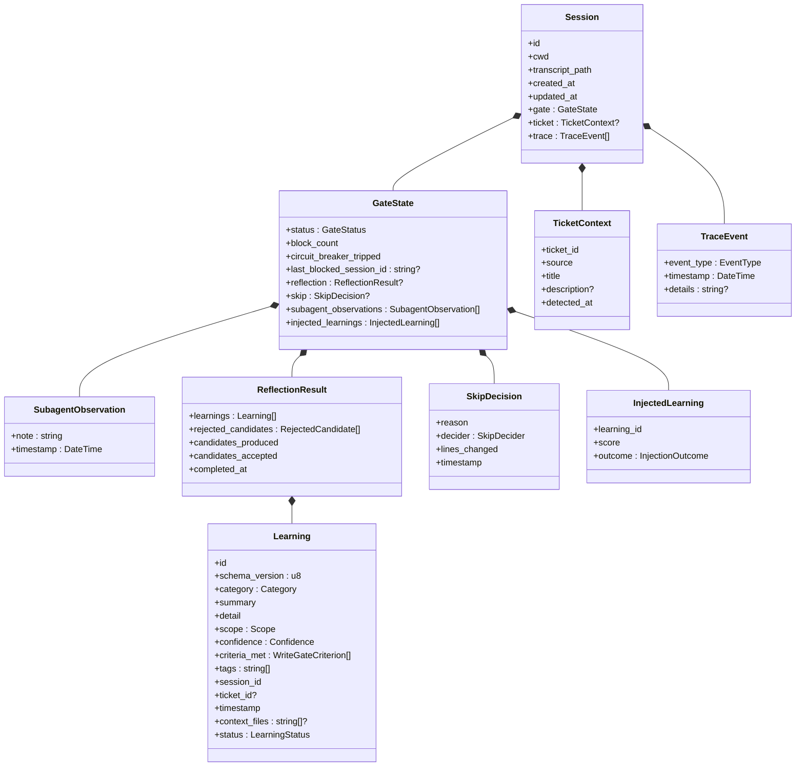

### 3.2 Learning Categories

| Category | Description |
|----------|-------------|
| **Pattern** | A reusable code pattern or architectural approach |
| **Pitfall** | A mistake made or gotcha encountered (with fix) |
| **Convention** | A project convention learned or established |
| **Dependency** | Something learned about a library, API, or external system |
| **Process** | A workflow improvement or development process insight |
| **Domain** | Business logic or domain knowledge captured |
| **Debugging** | A debugging technique or diagnostic approach that worked |

### 3.3 Learning Scope

| Scope | Storage | Visibility |
|-------|---------|------------|
| **Project** | Primary backend (committed) | Whole team |
| **Team** | Primary backend (committed) | Whole team |
| **Personal** | `~/.grove/personal-learnings.md` (outside project) | Individual |
| **Ephemeral** | Daily log only (if available) | Transient |

**Scope routing** is a core logic responsibility, not a backend concern.
Core logic inspects the learning's scope and selects the appropriate
storage target. Project and Team scope route to the configured backend
(markdown or Total Recall). Personal scope always routes to the
local personal learnings file. Ephemeral scope routes to the daily log
(if Total Recall is active) or is discarded. Backends receive learnings
and write them — they don't make routing decisions.

### 3.4 Learning Lifecycle

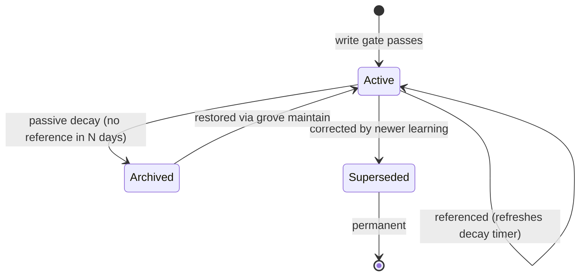

### 3.5 Confidence Levels

| Confidence | Description |
|------------|-------------|
| **High** | Well tested, established, or explicitly confirmed |
| **Medium** | Reasonable certainty based on evidence (default) |
| **Low** | Uncertain, speculative, or needs validation |

Confidence is derived from write gate criterion plausibility during
reflection. Learnings with strong indicator phrases receive higher
confidence; those with weaker phrasing receive lower confidence.

### 3.6 Trace Events

Each session maintains a trace of events for debugging and auditing.

| EventType | Description |
|-----------|-------------|
| `SessionStart` | Session initialized |
| `TicketDetected` | Ticketing system detected a ticket |
| `BackendDetected` | Memory backend discovered |
| `LearningsInjected` | Relevant learnings injected at session start |
| `TicketCloseDetected` | Ticket close command detected (PreToolUse) |
| `TicketClosed` | Ticket close confirmed (PostToolUse success) |
| `TicketCloseFailed` | Ticket close failed (PostToolUse failure) |
| `StopHookCalled` | Stop hook invoked |
| `GateBlocked` | Gate blocked session exit |
| `ReflectionComplete` | Reflection successfully recorded |
| `Skip` | Skip decision made |
| `CircuitBreakerTripped` | Circuit breaker tripped after max blocks |
| `SessionEnd` | Session ending |
| `ObservationRecorded` | Subagent observation recorded |
| `LearningReferenced` | Injected learning was referenced |
| `LearningDismissed` | Injected learning was not used |
| `GateStatusChanged` | Gate status transitioned |

Trace events are stored in session state and can be viewed with
`grove trace <session_id>`.

## 4. Gate State Machine

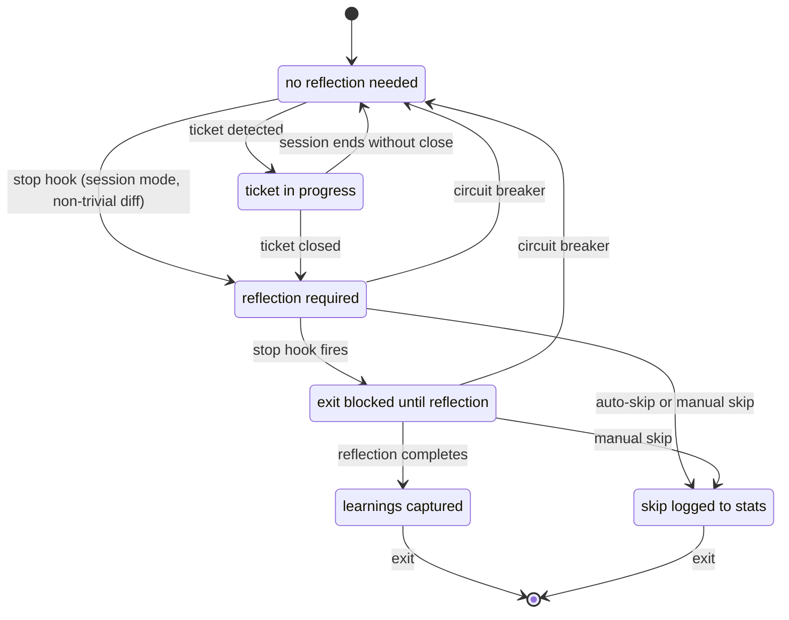

### 4.1 Transitions

| From | Event | To | Action |
|------|-------|----|--------|
| Idle | Ticket detected via discovery | Active | Store ticket context |
| Idle | Stop hook (session mode, diff > threshold) | Pending | Enable gate |
| Active | Ticket close detected (PreToolUse) | Pending | Enable gate |
| Pending | Ticket close failed (PostToolUse) | Active | Revert transition, log |
| Active | Session ends without close | Idle | No reflection needed |
| Pending | Stop hook fires | Blocked | Block with instructions |
| Pending | Auto-skip (under threshold) | Skipped | Log skip to stats |
| Pending | Manual skip with reason | Skipped | Log skip to stats |
| Pending | Circuit breaker trips | Idle | Force approve, log warning |
| Blocked | Reflection completes | Reflected | Write learnings, log stats |
| Blocked | Manual skip with reason | Skipped | Log skip to stats |
| Blocked | Circuit breaker trips | Idle | Force approve, log warning |
| Reflected | Stop hook fires again | [*] | Allow exit |
| Skipped | Stop hook fires again | [*] | Allow exit |

### 4.2 Circuit Breaker

Prevents infinite blocking loops.

| Parameter | Default | Description |
|-----------|---------|-------------|
| `max_blocks` | 3 | Maximum blocks before tripping |
| `cooldown_seconds` | 300 | Time before breaker resets |

Behavior: each block increments a counter. When the counter reaches
`max_blocks`, the breaker trips, forcing an approve and logging a warning.

**Reset conditions** (any one triggers reset):

1. Cooldown elapsed since last block
2. Different `session_id` from last blocked session
3. Successful reflection completes

The breaker tracks `last_blocked_session_id` to distinguish new sessions
from retries within the same session.

## 5. Discovery

### 5.1 Ticketing System Discovery

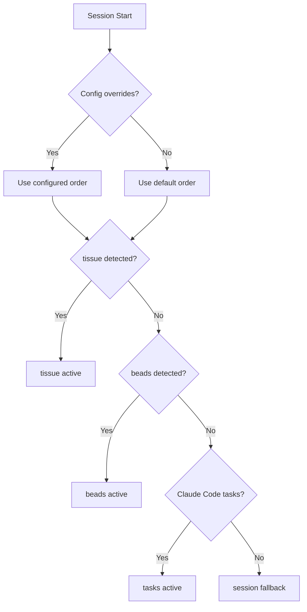

Default discovery order: `tissue → beads → tasks → session`

Each ticketing system has a detection probe (check for marker directory or
config) and a close pattern (command pattern that signals ticket completion).

| System | Detection | Close Pattern |
|--------|-----------|---------------|
| tissue | `.tissue/` exists | `tissue status * closed` |
| beads | `.beads/` exists | `beads close *`, `beads complete *` |
| tasks | Claude Code tasks active | Task completion signal |
| session | Always available | Stop hook fires (fallback) |

Discovery order is configurable. Individual systems can be disabled.

### 5.2 Memory Backend Discovery

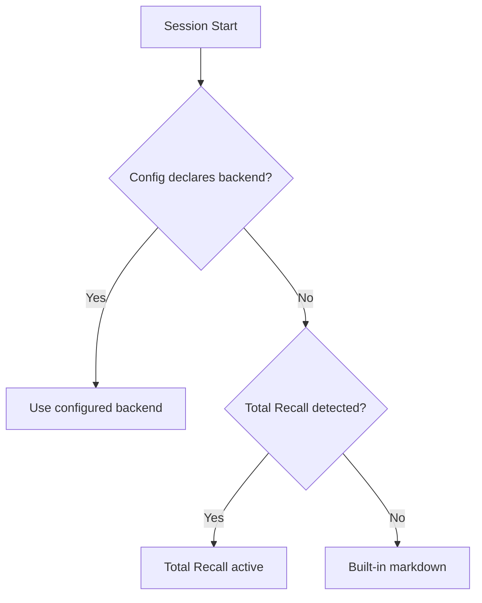

Default discovery order: `config → total-recall → markdown`

| Backend | Detection |
|---------|-----------|
| Config explicit | `.grove/config.toml` declares a backend |
| Total Recall | `memory/` directory + `rules/total-recall.md` exists |
| Markdown | Always available (built-in fallback) |

Multiple backends can be active simultaneously. Learnings route by scope.
Discovery order is configurable. Individual backends can be disabled.

### 5.3 Total Recall Integration Details

When Total Recall is detected, Grove leverages its tiered memory system
while maintaining Grove's structured reflection model.

#### 5.3.1 Architecture Relationship

Total Recall and Grove are complementary systems:

| Aspect | Total Recall | Grove |
|--------|--------------|-------|
| **Trigger** | Voluntary ("remember this") | Gate-enforced at ticket boundary |
| **Structure** | Free-form notes | Seven-category taxonomy |
| **Tiers** | Working → Registers → Daily → Archive | Single tier (routed by scope) |
| **Promotion** | User-driven via `/recall-promote` | Not applicable |
| **Write Gate** | Five criteria | Four criteria (subset overlap) |

Grove writes to Total Recall's daily logs. Promotion to registers remains
a user action — Grove does not auto-promote.

#### 5.3.2 Write Gate Compatibility

Both systems filter low-value content before persistence. Grove's criteria
are a near-subset of Total Recall's:

| Grove | Total Recall | Notes |
|-------|--------------|-------|
| `behavior_changing` | Behavioral impact | Direct match |
| `decision_rationale` | Decisions | Direct match |
| `stable_fact` | Stable facts | Direct match |
| `explicit_request` | Explicit requests | Direct match |
| — | Commitments | TR-only (deadlines) |

Because Grove already validates learnings, the adapter writes directly to
Total Recall's daily log files rather than using the interactive
`/recall-write` skill, avoiding redundant validation.

**Note:** Total Recall's skills (`/recall-write`, `/recall-log`) are
interactive Claude Code skills that work within conversations, not CLI
commands that can be invoked as subprocesses. Grove writes directly to
the same `memory/daily/YYYY-MM-DD.md` files that Total Recall uses.

#### 5.3.3 Scope to Tier Mapping

Grove's learning scopes route to Total Recall tiers:

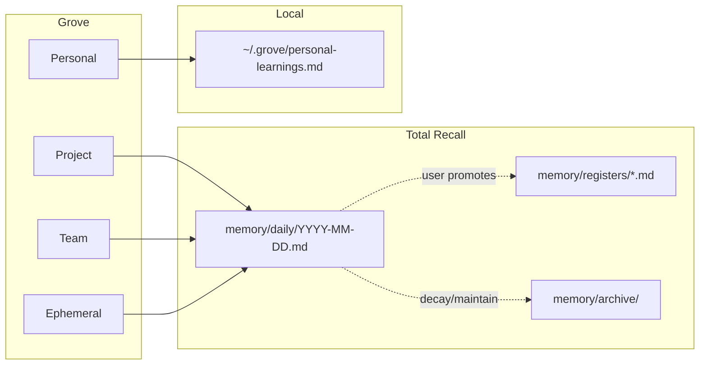

Grove writes all project/team/ephemeral scope learnings to daily logs.
Users can promote high-value learnings to registers via `/recall-promote`.
Grove's `maintain` command respects Total Recall's archive structure.

#### 5.3.4 Search Integration

Grove searches Total Recall's memory files directly:

1. **Query construction**: Grove combines ticket context, file paths,
   and tags into a search term
2. **File search**: Grove reads daily logs (last 14 days) and registers,
   filtering for entries with `grove:` prefix that match the query
3. **Result parsing**: Grove parses markdown results back into
   `CompoundLearning` objects (partial — some metadata may be lost)
4. **Scoring**: Grove applies its own composite scoring (relevance ×
   recency × hit rate)

Grove searches daily logs first (most recent), then registers.
Archive files are not searched by default.

#### 5.3.5 Daily Log Entry Format

Grove learnings appear in Total Recall daily logs with this format:

```markdown
## Learnings

[14:32] **Pitfall** (grove:learn-abc123): Using unwrap() in async context
> When an async task panics due to unwrap(), the entire runtime is at
> risk. Use `?` with proper error context instead.

Tags: #rust #async #error-handling | Confidence: High | Ticket: grove-abc123
```

The `grove:` prefix in IDs enables filtering Grove-originated entries.

#### 5.3.6 Supersession Protocol

When Grove detects a learning that supersedes an existing one:

1. Grove marks the old learning as `Superseded` in its stats log
2. The new learning includes a supersession reference:

```markdown
[14:45] **Pitfall** (grove:learn-def456): Correct async error handling
> [supersedes grove:learn-abc123 — previous advice was incomplete]
> The correct approach is...
```

This aligns with Total Recall's contradiction protocol (old claims
receive `[superseded]` markers rather than silent overwrites).

#### 5.3.7 Fail-Open Behavior with Markdown Fallback

When Total Recall is the primary backend, Grove automatically wraps it with
a markdown fallback. If Total Recall write fails, learnings are persisted
to `.grove/learnings.md` instead.

| Failure | Grove Behavior |
|---------|----------------|
| `memory/` not writable | Fall back to markdown backend |
| Daily log write fails | Fall back to markdown backend |
| Search fails | Return empty results (fail-open) |
| Total Recall uninstalled mid-session | Fall back to markdown backend |

The fallback is automatic and transparent — learnings are always persisted
somewhere. The `WriteResult.message` field indicates when fallback was used.

Grove never blocks user workflow due to Total Recall failures.

## 6. Validation and Write Gate

Candidate learnings pass through a two-layer validation funnel before
being written to the backend. A third layer (stats-driven decay) operates
retrospectively.

### 6.1 Layer 1: Schema Validation

Structural validation. Deterministic, runs first.

| Field | Rule | On Failure |
|-------|------|------------|
| `category` | One of 7 enum values | Reject candidate |
| `summary` | 10-200 characters | Reject candidate |
| `detail` | 20-2000 characters | Reject candidate |
| `summary ≠ detail` | Must differ | Reject candidate |
| `tags` | 1-10 non-empty strings | Reject candidate |
| `scope` | One of 4 enum values | Default to `project` |
| `criteria_met` | At least one criterion claimed | Reject candidate |

On total failure (no valid JSON, or zero candidates after schema
validation): `grove reflect` returns an error. The Stop hook relays this
to Claude for retry. Circuit breaker applies if retries fail.

On partial failure (some candidates valid, some not): valid candidates
proceed to Layer 2. Rejections logged with reasons.

### 6.2 Layer 2: Write Gate Filter

Quality validation. Heuristic, runs on candidates that passed schema
validation.

Each candidate must claim at least one write gate criterion via the
`criteria_met` field:

| # | Criterion | Question |
|---|-----------|----------|
| 1 | `behavior_changing` | Would you do something differently next time? |
| 2 | `decision_rationale` | Why was X chosen over Y? |
| 3 | `stable_fact` | Will this matter in future sessions? |
| 4 | `explicit_request` | Did the user say "remember this"? |

Grove validates that the claimed criterion is plausible given the content.
The primary defense is tracking: if 100% of candidates claim
`behavior_changing` and hit rates are low, the insights engine flags this
as potential rubber-stamping.

### 6.3 Near-Duplicate Detection

Before writing, grove checks active learnings for substantially similar
summaries (case-insensitive substring match). Duplicates are rejected and
logged. This prevents the "I learned about the codebase" failure mode where
Claude produces the same generic learning every session.

### 6.4 Rejected Candidate Tracking

Rejected candidates are recorded (summary only) for write gate
effectiveness analysis. If a rejected topic appears in a later reflection
as an accepted learning, it signals the gate may be too aggressive.

### 6.5 Layer 3: Stats-Driven Decay (Retrospective)

Not a write-time check. Learnings that pass Layers 1 and 2 and are written
to the backend are subject to passive decay based on usage stats. Learnings
that are surfaced but never referenced accumulate low hit rates and are
eventually archived. See Section 8 (Passive Decay) in the Stats document.

## 7. Hook Behaviors

### 7.1 Session Start

Fires when a Claude Code session begins.

**Session identity:** All hook payloads include `session_id` (UUID v4) and
`transcript_path` via stdin JSON. Grove uses `session_id` as the primary
key for session state, stored at `~/.grove/sessions/<session_id>.json`.

**Resume handling:** When `source` is `"resume"`, Claude Code issues a new
`session_id`. Grove creates a fresh session. Ticket context and learnings
are discovered anew.

**Compact handling:** When `source` is `"compact"`, the same `session_id`
is reused. Grove loads the existing session file.

Steps:

1. Read `session_id`, `cwd`, `transcript_path` from stdin JSON
2. Create or load session state
3. Discover ticketing system (probe in configured order)
4. Discover memory backends (probe in configured order)
5. Load stats and learnings index
6. Search for learnings relevant to current context
7. Score and rank candidates (composite: relevance × recency × hit rate)
8. Record "surfaced" event in stats log for each injected learning
9. Return context with top N learnings via `additionalContext`
10. Run passive decay check (throttled to once per day)

### 7.2 Pre-Tool-Use

Fires before Claude Code executes a tool.

1. Match tool name and input against ticket close patterns
2. If match: transition gate immediately (Idle/Active → Pending), add trace event
3. Allow the tool to proceed (gate fires on Stop, not here)

Design choice: unlike roz which denies tools, grove allows ticket-close tools.
The ticket close should succeed; reflection happens before the session ends.

**Note:** We transition the gate in PreToolUse rather than waiting for
PostToolUse because PostToolUse hooks may not fire reliably in all Claude Code
configurations. This follows the same pattern used by the Roz quality gate
plugin. If the command fails, the circuit breaker provides a safety valve.

### 7.3 Post-Tool-Use

Fires after Claude Code executes a tool. **Note:** This hook serves as a
fallback mechanism — PostToolUse may not fire reliably in all configurations.

1. If gate is Pending and `tool_response.success` is false:
   - Revert gate status Pending → Active
   - Log trace event ("ticket close failed, reverting gate")
2. Otherwise: no-op (gate was already transitioned in PreToolUse)

Since PostToolUse may not fire reliably, Grove assumes commands succeed and
transitions the gate in PreToolUse. The circuit breaker provides a safety
valve if this assumption proves wrong.

### 7.4 Stop

Fires when Claude Code attempts to end a response.

1. If gate status is Reflected or Skipped → approve
2. If gate status is Idle (session mode):
   - Compute diff size via `git diff --stat` (cached in session state)
   - If not a git repo, treat diff size as "unknown" (skip threshold check)
   - If under threshold and auto-skip enabled → agent decides → log → approve
3. If gate status is Active or Pending:
   - Check circuit breaker → if tripped, force approve with warning
   - Increment block counter
   - Block with instructions to run reflection
4. Log trace event

**Diff size computation:** Grove shells out to `git diff --stat HEAD` in
the Stop hook. This adds ~50ms latency but gives accurate line counts. The
result is cached in session state so subsequent Stop invocations (after
block → retry) don't recompute. In non-git repositories, diff size is
unavailable and the auto-skip threshold check is bypassed (agent always
decides).

### 7.5 Session End

Fires when a Claude Code session terminates.

1. Load session state
2. For each injected learning not marked as referenced: append a
   `dismissed` event to the stats log
3. Clean up any temporary state
4. Always allows session termination (SessionEnd hooks cannot block)

This hook is the authoritative point for dismissed detection. Previously
dismissed inference happened at the Stop hook, but Stop fires before
session end and may fire multiple times. SessionEnd fires exactly once,
after all work is complete.

**Note:** SessionEnd reason codes include `clear`, `logout`,
`prompt_input_exit`, and `other`. Grove processes all of them identically.

## 8. Multi-Agent Behavior

When parallel subagents are running:

- **Subagents** log lightweight observations via `grove observe`. No gate,
  no structured reflection, just append-only notes to the session.
- **The orchestrator** performs the full structured reflection when the ticket
  closes. It draws on subagent observations when synthesizing learnings.
- **The gate only fires for the orchestrator.** Subagent stop events do not
  trigger the compound learning gate.

This prevents noisy, overlapping reflections while preserving
subagent-specific insights.

## 9. Sequence Diagrams

### 9.1 Happy Path: Ticket Close with Reflection

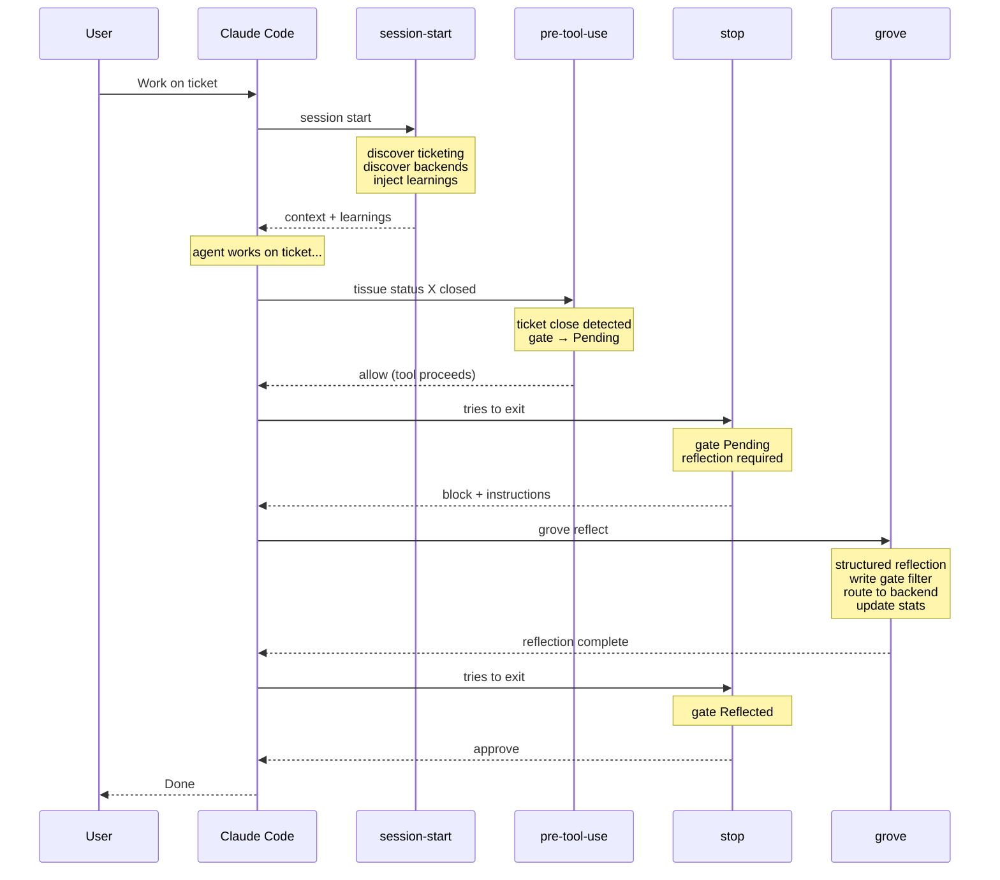

### 9.2 Auto-Skip: Trivial Change

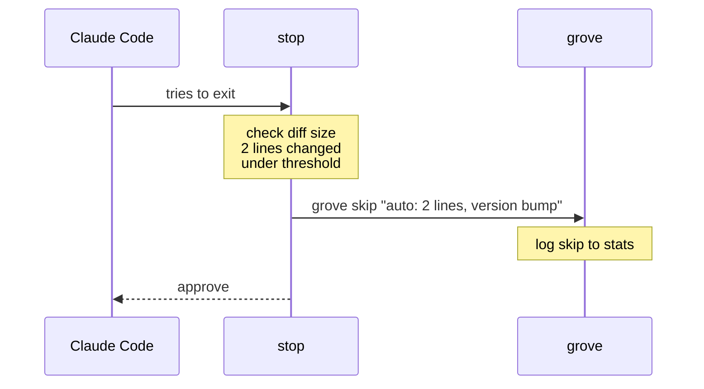

### 9.3 Multi-Agent: Subagent Observations

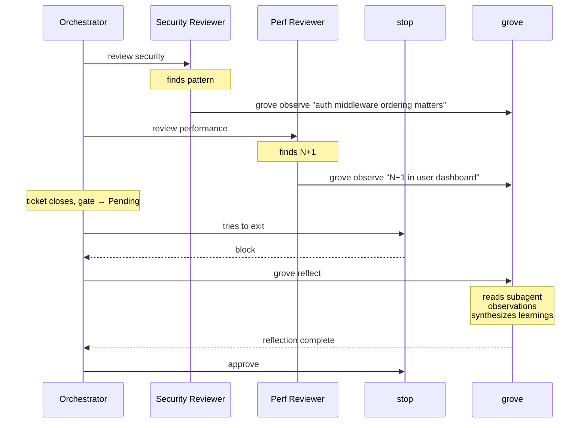

### 9.4 Circuit Breaker

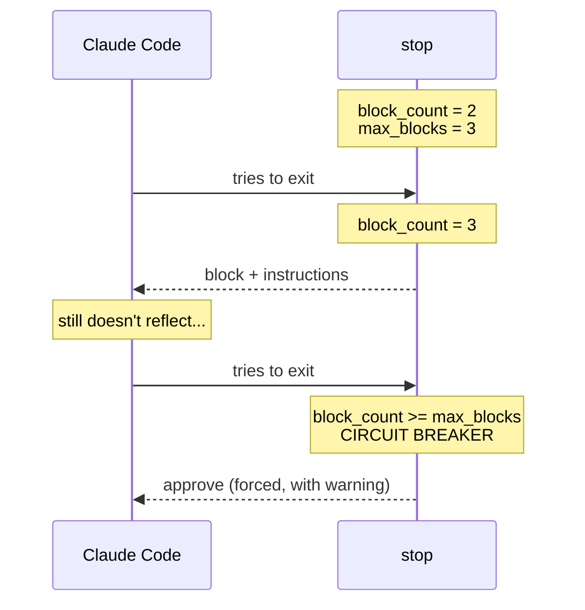

### 9.5 Retrieval: Learning Injection at Session Start

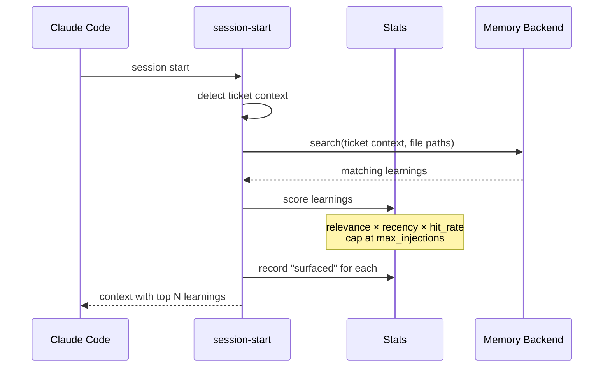

### 9.6 Total Recall Backend: Write Flow

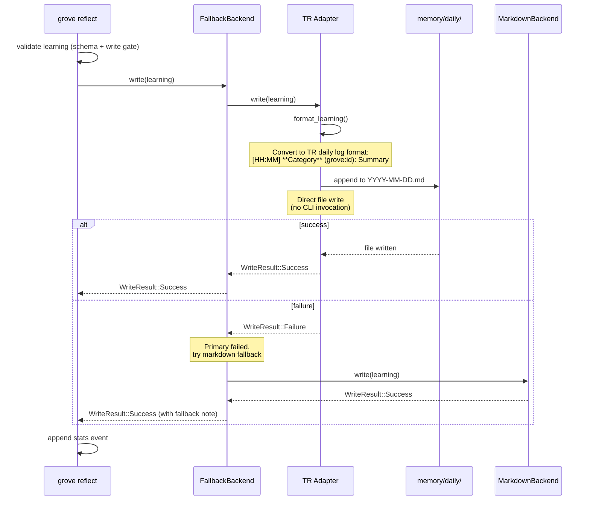

### 9.7 Total Recall Backend: Search Flow

```mermaid
sequenceDiagram
    participant SS as session-start
    participant Fallback as FallbackBackend
    participant TR as TR Adapter
    participant Daily as memory/daily/
    participant Registers as memory/registers/
    participant MD as MarkdownBackend

    SS->>Fallback: search(query, filters)
    Fallback->>TR: search(query, filters)

    TR->>TR: build_search_term()
    Note over TR: Combine ticket title,<br/>file stems, tags

    TR->>Daily: read last 14 days
    TR->>Registers: read register files
    Note over TR: Direct file search<br/>(no CLI invocation)

    TR->>TR: filter for grove: prefix
    TR->>TR: parse_search_results()
    Note over TR: Extract grove: prefixed entries<br/>Reconstruct CompoundLearning (partial)

    TR-->>Fallback: Vec<SearchResult>

    Fallback->>MD: search(query, filters)
    MD-->>Fallback: Vec<SearchResult>

    Fallback->>Fallback: merge & deduplicate
    Fallback-->>SS: Vec<SearchResult>
    end

    SS->>SS: apply composite scoring
```

## 10. Storage Architecture

### 10.1 File Layout

**Standard layout (markdown backend):**

```text
~/.grove/                          # User-level (not committed)
├── sessions/
│   ├── <session-id>.json          # Per-session state
│   └── ...
├── stats-cache.json               # Materialized stats aggregate
├── personal-learnings.md          # Personal scope learnings
└── config.toml                    # Optional user config

<project>/
├── .grove/
│   ├── config.toml                # Optional project config
│   ├── learnings.md               # Append-only learnings (built-in backend)
│   └── stats.log                  # Append-only event log (JSONL)
```

**Layout with Total Recall backend:**

```text
~/.grove/                          # User-level (not committed)
├── sessions/
│   ├── <session-id>.json          # Per-session state
│   └── ...
├── stats-cache.json               # Materialized stats aggregate
├── personal-learnings.md          # Personal scope (bypasses TR)
└── config.toml                    # Optional user config

<project>/
├── .grove/
│   ├── config.toml                # Optional project config
│   └── stats.log                  # Append-only event log (JSONL)
│                                  # NOTE: No learnings.md when TR is active
├── memory/                        # Total Recall managed
│   ├── daily/
│   │   ├── 2025-01-15.md          # Daily log (Grove writes here)
│   │   └── ...
│   ├── registers/
│   │   └── *.md                   # User-promoted entries
│   └── archive/
│       └── *.md                   # Archived/superseded
├── rules/
│   └── total-recall.md            # Total Recall protocol
└── CLAUDE.local.md                # Working memory (gitignored)
```

When Total Recall is the active backend:

- Grove writes learnings to `memory/daily/YYYY-MM-DD.md`
- Grove does NOT write to `.grove/learnings.md`
- Grove maintains its own `stats.log` for tracking
- Personal scope learnings always go to `~/.grove/personal-learnings.md`

### 10.2 Session Storage Interface

| Operation | Description |
|-----------|-------------|
| `get(id)` | Retrieve session by ID |
| `put(session)` | Save session (atomic write) |
| `list(limit)` | List recent sessions |
| `delete(id)` | Remove session |

### 10.3 Memory Backend Interface

| Operation | Description |
|-----------|-------------|
| `write(learning)` | Write a learning to the backend |
| `search(query, filters)` | Search for relevant learnings |
| `ping()` | Health check / availability |

**Search semantics vary by backend:**

| Backend | Search Implementation |
|---------|---------------------|
| **Markdown** | Parse `.grove/learnings.md`, match tags against query tags (exact match = 1.0, partial = 0.5), match file paths against `context_files` (overlap = 0.8), keyword substring match against summary and detail (0.3). Return all matches with relevance scores. |
| **Total Recall** | Read daily logs (last 14 days) and registers directly, filtering for `grove:` prefixed entries. Match query terms against content. Grove applies its own composite scoring. Note: search results may be partial (not all learning metadata is preserved in Total Recall's format). |

The `query` parameter is a structured object containing available context:
ticket title, ticket description, file paths from the current diff, and
tags extracted from the ticket. It is not a free-text search string.

The `filters` parameter supports: `status` (active only by default),
`scope` (project/team/personal), `created_after` (for recency), and
`max_results`.

### 10.4 Backend Implementations

| Backend | Storage | Use Case |
|---------|---------|----------|
| **Markdown** | `.grove/learnings.md` | Default, no dependencies |
| **Total Recall** | `memory/daily/*.md` | Projects using Total Recall for memory |
| **In-Memory** | None (ephemeral) | Testing only |

**Total Recall specifics:**

- **Write destination:** `memory/daily/YYYY-MM-DD.md` (daily log)
- **Write method:** Direct file append (no CLI invocation)
- **Fallback:** Markdown backend (`.grove/learnings.md`) on write failure
- **ID format:** `grove:learn-<ulid>` prefix enables filtering Grove entries
- **Promotion:** Grove does not auto-promote; users promote via `/recall-promote`
- **Supersession:** Grove includes `[supersedes grove:<id>]` markers

## 11. Configuration

All configuration is optional. The system runs with sensible defaults when
no config exists.

### 11.1 Config Precedence

1. Environment variables (`GROVE_HOME`, etc.)
2. Project config (`.grove/config.toml`)
3. User config (`~/.grove/config.toml`)
4. Defaults

### 11.2 Config Shape

| Section | Key | Default | Description |
|---------|-----|---------|-------------|
| ticketing | discovery | `[tissue, beads, tasks, session]` | Ordered probe list |
| ticketing | overrides | `{}` | Per-system enable/disable |
| backends | discovery | `[config, total-recall, markdown]` | Ordered probe list |
| backends | overrides | `{}` | Per-backend enable/disable |
| gate | auto_skip.enabled | `true` | Allow auto-skip for trivial changes |
| gate | auto_skip.line_threshold | `5` | Diff size below which auto-skip applies |
| gate | auto_skip.decider | `agent` | Who decides: `agent`, `always`, `never` |
| decay | passive_duration_days | `90` | Days without reference before archival |
| decay | immunity_hit_rate | `0.8` | Hit rate above which decay is skipped |
| retrieval | max_injections | `5` | Max learnings injected per session |
| retrieval | strategy | `moderate` | `conservative`, `moderate`, `aggressive` |
| circuit_breaker | max_blocks | `3` | Blocks before forced approve |
| circuit_breaker | cooldown_seconds | `300` | Cooldown before breaker resets |

## 12. Error Philosophy

### 12.1 Fail-Open

Infrastructure errors never block work. If grove can't read state, write
stats, or reach a backend, the gate approves and logs a warning. A lost
learning is better than a stuck developer.

### 12.2 Specific Fail-Open Behaviors

| Scenario | Behavior |
|----------|----------|
| Session state unreadable | Approve exit |
| Backend unreachable | Log warning, skip learning write, still mark reflected |
| Stats file corrupt | Log warning, rebuild on next `grove maintain` |
| Discovery fails | Proceed with no ticketing / fallback backend |
| Reflection parsing fails | Approve exit, log error |

## Related Documents

- [Overview](./00-overview.md) - Vision, core concepts, design principles
- [Implementation](./02-implementation.md) - Concrete types, file layouts,
  module structure
- [Stats and Quality](./03-stats-and-quality.md) - Quality tracking model,
  retrieval scoring, insights engine
- [Test Plan](./04-test-plan.md) - Testing strategy
- [CI](./05-ci.md) - Version management and release workflow
