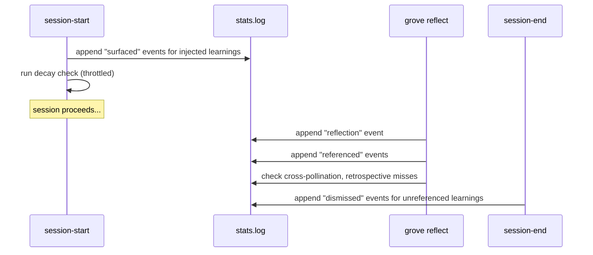

# grove - Stats and Quality

This document describes the quality tracking model, retrieval scoring,
passive decay, and the insights engine. This is the feedback loop that makes
the system improve over time.

## 1. Stats Architecture: Event Log + Materialized Cache

Stats are stored as two files:

**`.grove/stats.log`** — Append-only JSONL event log (committed, shared).
Each line is a single JSON object representing one event. This is the
source of truth.

**`~/.grove/stats-cache.json`** — Materialized aggregate (local, not
committed). Rebuilt from the event log when stale. Used by `grove stats`
for fast dashboard reads.

### 1.1 Why Not a JSON Object?

The original design used `.grove/stats.json` (a JSON object with nested
counters). This creates git merge conflicts when two developers (or two
parallel sessions) update the same learning's counters simultaneously.

An append-only JSONL log eliminates merge conflicts entirely. Git can
always auto-merge appends to the end of a file. The aggregate view is
materialized locally and rebuilt on demand.

### 1.2 Event Types

```jsonl
{"ts":"2026-02-06T10:00:00Z","event":"surfaced","learning_id":"L001","session_id":"abc"}
{"ts":"2026-02-06T10:05:00Z","event":"referenced","learning_id":"L001","session_id":"abc","ticket_id":"T042"}
{"ts":"2026-02-06T11:00:00Z","event":"dismissed","learning_id":"L003","session_id":"abc"}
{"ts":"2026-02-06T11:00:00Z","event":"corrected","learning_id":"L005","session_id":"abc","superseded_by":"L012"}
{"ts":"2026-02-06T11:00:00Z","event":"reflection","session_id":"abc","candidates":5,"accepted":3,"categories":["pitfall","pattern"],"ticket_id":"T042","backend":"markdown"}
{"ts":"2026-02-06T11:00:00Z","event":"skip","session_id":"abc","reason":"auto: 2 lines, version bump","decider":"agent","lines_changed":2,"ticket_id":"T042"}
{"ts":"2026-02-06T11:00:00Z","event":"archived","learning_id":"L002","reason":"passive_decay"}
{"ts":"2026-02-06T11:00:00Z","event":"restored","learning_id":"L002"}
{"ts":"2026-02-06T11:00:00Z","event":"checkpoint","processed_through":"2026-01-06T00:00:00Z","aggregate":{}}
```

| Event | Fields | Written By |
|-------|--------|------------|
| `surfaced` | learning_id, session_id | `grove hook session-start` |
| `referenced` | learning_id, session_id, ticket_id? | `grove reflect` |
| `dismissed` | learning_id, session_id | `grove hook session-end` |
| `corrected` | learning_id, session_id, superseded_by? | `grove reflect` or `grove maintain` |
| `reflection` | session_id, candidates, accepted, categories[], ticket_id?, backend | `grove reflect` |
| `skip` | session_id, reason, decider, lines_changed, ticket_id? | `grove skip` |
| `archived` | learning_id, reason | Passive decay check |
| `restored` | learning_id | `grove maintain` |
| `checkpoint` | processed_through, aggregate | `grove maintain --compact-log` |

### 1.3 Materialized Cache

```json
{
  "generated_at": "2026-02-06T11:00:00Z",
  "log_entries_processed": 847,
  "learnings": {
    "L001": {
      "surfaced": 12,
      "referenced": 8,
      "dismissed": 4,
      "corrected": 0,
      "hit_rate": 0.67,
      "last_surfaced": "2026-04-15T10:00:00Z",
      "last_referenced": "2026-04-15T10:00:00Z",
      "origin_ticket": "T001",
      "referencing_tickets": ["T042", "T055"]
    }
  },
  "reflections": {
    "completed": 23,
    "skipped": 8,
    "by_backend": { "markdown": 20, "total_recall": 3 }
  },
  "write_gate": {
    "total_evaluated": 83,
    "total_accepted": 64,
    "total_rejected": 19,
    "pass_rate": 0.77,
    "rejection_reasons": {
      "schema_validation": 4,
      "not_behavior_changing": 8,
      "near_duplicate": 3,
      "transient_observation": 4
    },
    "retrospective_misses": 2
  },
  "cross_pollination": [
    { "learning_id": "L001", "origin_ticket": "T001", "referenced_in": ["T042", "T055"] }
  ],
  "aggregates": {
    "total_learnings": 83,
    "total_archived": 6,
    "average_hit_rate": 0.54,
    "cross_pollination_count": 9,
    "by_category": {
      "pitfall": { "count": 22, "avg_hit_rate": 0.71 },
      "pattern": { "count": 18, "avg_hit_rate": 0.62 },
      "convention": { "count": 15, "avg_hit_rate": 0.48 }
    },
    "by_scope": {
      "project": { "count": 45, "avg_hit_rate": 0.58 },
      "team": { "count": 30, "avg_hit_rate": 0.52 }
    }
  }
}
```

**Staleness check:** Compare `log_entries_processed` against actual line
count in `.grove/stats.log`. If they differ, rebuild.

**Rebuild:** `grove stats` automatically rebuilds the cache from the log.
`grove maintain --rebuild-stats` forces a rebuild.

### 1.4 Log Rotation

Over months, the log grows. `grove maintain --compact-log` compresses
old entries:

1. Materialize the aggregate for all entries older than N days (default: 90)
2. Write a single `checkpoint` event containing the aggregate
3. Remove the old entries
4. Append new entries after the checkpoint

The checkpoint event preserves aggregate counts. Detail (individual event
timestamps, per-session breakdowns) is lost for the compacted period.

## 2. Per-Learning Stats

Derived from the event log. The cache stores aggregated counters per
learning ID.

| Field | Derived From |
|-------|--------------|
| `surfaced` | Count of `surfaced` events for this learning_id |
| `referenced` | Count of `referenced` events |
| `dismissed` | Count of `dismissed` events |
| `corrected` | Count of `corrected` events |
| `hit_rate` | `referenced / surfaced` (0 if never surfaced) |
| `last_surfaced` | Most recent `surfaced` event timestamp |
| `last_referenced` | Most recent `referenced` event timestamp |
| `origin_ticket` | Ticket ID from the learning's creation |
| `referencing_tickets` | Unique ticket IDs from `referenced` events with different tickets |

### 2.1 Detection Methods

| Event | How Detected | Hook |
|-------|--------------|------|
| **Surfaced** | `session-start` injects learning, appends event | SessionStart |
| **Referenced** | `grove reflect` output includes "applied learning [ID]" | grove reflect |
| **Dismissed** | Injected learning not referenced by session end | SessionEnd |
| **Corrected** | `grove reflect` output includes "corrected [ID]", or `grove maintain` | grove reflect / maintain |

### 2.2 Dismissed Detection

Dismissed events are appended by the SessionEnd hook, not the Stop hook.
SessionEnd fires exactly once per session, after all work is complete.
This avoids the problem of Stop firing multiple times (block → retry →
block → reflect → approve) and prematurely marking learnings as dismissed.

At SessionEnd, grove checks each `injected_learning` in the session state.
Any learning not marked as referenced gets a `dismissed` event appended
to the stats log. This is a lower bound — Claude may have used a learning
implicitly without citing its ID. The reflection skill prompt explicitly
asks "which injected learnings influenced your work?" to maximize explicit
references.

## 3. Per-Reflection Stats

Captured by the `reflection` event type.

| Field | Description |
|-------|-------------|
| `candidates` | Total learnings the reflection extracted |
| `accepted` | Passed schema validation + write gate |
| `categories` | Categories of accepted learnings |
| `backend` | Which backend received the learnings |
| `ticket_id` | Associated ticket (if any) |

### 3.1 Write Gate Tracking

The cache tracks aggregate write gate statistics including rejection
reasons. Rejection reasons include `schema_validation` (from Layer 1),
`near_duplicate` (from duplicate detection), and quality-based reasons
from the write gate filter.

**Retrospective miss detection**: When a rejected candidate's topic
appears in a later reflection as an accepted learning, the
`retrospective_misses` counter increments. Implementation: when
`grove reflect` accepts a learning, search recent rejected candidates
(last N reflections) for tag/summary overlap.

## 4. Skip Stats

Captured by the `skip` event type.

| Field | Description |
|-------|-------------|
| `reason` | Free-text reason for the skip |
| `decider` | `agent`, `auto`, or `user` |
| `lines_changed` | Diff size at time of skip |
| `ticket_id` | Associated ticket (if any) |

**Retrospective skip miss detection**: When a session that was skipped
touches the same files as a later session that produces learnings, it
suggests the skip may have been premature. Detection runs during
`grove stats` generation by cross-referencing skip events with subsequent
reflection events that share overlapping file paths.

## 5. Cross-Pollination

The strongest compound signal: knowledge flowing across work items.

A cross-pollination event is recorded when `grove reflect` notes that a
learning from a different ticket was applied. Derived from `referenced`
events where the referencing ticket differs from the learning's origin
ticket.

The cache maintains a list of cross-pollination edges for the "most
valuable learnings" view in `grove stats`.

## 6. Retrieval Scoring

When injecting learnings at session start, each candidate is scored:

```
score = relevance × recency_weight × reference_boost
```

### 6.1 Relevance

Computed by the backend's `search` method. For the built-in markdown
backend:

| Match Type | Score |
|------------|-------|
| Exact tag match | 1.0 |
| Partial tag match | 0.5 |
| File path overlap | 0.8 |
| Keyword in summary | 0.3 |
| No match | 0.0 |

Multiple matches are combined (max, not sum) to avoid over-weighting
learnings that happen to match on many axes.

The query is a structured object containing: ticket title, ticket
description, file paths from the current diff (or recent git log), and
tags extracted from the ticket context. It is not a free-text string.

### 6.2 Recency Weight

Exponential decay from creation date:

```
recency_weight = e^(-λ × days_since_creation)
```

Where `λ` is tuned so that a 90-day-old learning has weight ~0.3 and a
1-day-old learning has weight ~1.0.

### 6.3 Reference Boost

Learnings with proven value (high hit rate) get boosted:

```
reference_boost = 0.5 + (hit_rate × 0.5)
```

Range: 0.5 (never referenced) to 1.0 (always referenced). This prevents
new learnings from being completely buried by well-established ones while
still rewarding proven value.

### 6.4 Final Ranking

Learnings are sorted by composite score, descending. The top
`max_injections` (default: 5) are injected. Ties broken by recency.

### 6.5 Strategy Modes

| Strategy | Behavior |
|----------|----------|
| `conservative` | Only inject on exact tag/file match. max_injections capped at 3. |
| `moderate` | Tag + file + keyword matching. Default max_injections = 5. |
| `aggressive` | Include recent learnings (last 30 days) even without match. max_injections = 10. |

## 7. Passive Decay

### 7.1 Decay Evaluation

Run during `grove hook session-start` (throttled to once per day) and
during `grove maintain`.

For each active learning:

1. Compute `last_verified` from the stats cache:
   `max(last_referenced, last_surfaced, created_at)`
2. If `now - last_verified > passive_duration_days` → mark as `archived`
3. Append an `archived` event to the stats log
4. Archived learnings are excluded from future injection but remain
   searchable

### 7.2 Decay Immunity

Learnings with a hit rate above a configurable threshold (default: 0.8)
are immune to passive decay. They've proven their value and should persist
until explicitly archived.

### 7.3 Archive Format

In the built-in markdown backend, archived learnings have their status
changed in-place:

```markdown
### [cl_20260206_001] N+1 query in UserDashboard#index
- **Status:** archived (decayed 2026-05-07)
```

### 7.4 Correction Propagation

When a learning is corrected (status → `superseded`):

1. A `corrected` event is appended to the stats log with `superseded_by`
2. The learning is immediately excluded from future retrieval
3. The superseding learning carries a `supersedes` field linking to the
   old ID, making the relationship explicit
4. If the corrected learning was recently surfaced (within last 7 days),
   the next session-start injects a correction notice: "Learning [ID] was
   corrected — [summary of what changed]"

Proactive correction notices are best-effort and deferred to v2 if
implementation complexity is high.

## 8. Insights Engine

The `grove stats` command interprets patterns and suggests tuning.

### 8.1 Insight Types

| Insight | Trigger | Suggestion |
|---------|---------|------------|
| `LowHitCategory` | Category hit rate < 0.3 over 10+ learnings | "Convention learnings have low hit rates — consider being more specific" |
| `HighValueRare` | Category hit rate > 0.7 but < 5 learnings | "Debugging learnings are high-value but rare — reflect more on debug approaches" |
| `SkipMiss` | Skipped session later produced learnings in same area | "2 skipped sessions later produced learnings in the same area" |
| `WriteGateTooStrict` | Write gate pass rate < 0.5 | "Write gate is rejecting most candidates — consider relaxing criteria" |
| `WriteGateTooLoose` | Write gate pass rate > 0.95 and avg hit rate < 0.3 | "Most learnings pass the gate but few are referenced — tighten criteria" |
| `RubberStamping` | >90% of candidates claim same criterion | "Most learnings claim behavior_changing — reflection may not be evaluating criteria carefully" |
| `HighCrossPollination` | Cross-pollination count growing | "9 learnings referenced outside originating ticket — compound effect active" |
| `DecayWarning` | N learnings approaching decay threshold | "3 learnings approaching 90-day archive threshold — run grove maintain" |
| `StaleTopLearning` | Most-referenced learning not referenced in 60+ days | "Your top learning hasn't been referenced recently — verify it's still accurate" |

### 8.2 Insight Generation

Insights are generated on-the-fly by `grove stats` from the materialized
cache, not stored. Each insight function receives the cache and returns
`Option<Insight>`.

### 8.3 Dashboard Output

```text
$ grove stats

Grove Stats (last 30 days)
──────────────────────────────────────

Reflections: 23 completed, 8 skipped (26% skip rate)
Learnings:   41 written, 12 filtered (77% write gate pass rate)
             4 rejected by schema, 3 near-duplicates
Hit rate:    0.61 overall (referenced / surfaced)

By Category         Count   Hit Rate   Trend
─────────────       ─────   ────────   ─────
pitfall               14     0.71      ↑
pattern               10     0.65      →
convention             8     0.42      ↓
dependency             5     0.60      →
debugging              4     0.75      ↑
process                3     0.33      →
domain                 2     0.50      →

Cross-pollination: 9 learnings referenced outside originating ticket
Most valuable:     "N+1 query in UserDashboard" (8 refs across 4 tickets)
Stale:             3 learnings approaching 90-day archive threshold

Insights:
  • Convention learnings have low hit rates (0.42) — consider being more
    specific when capturing conventions
  • Debugging learnings are high-value (0.75) but rare (4 total) — reflect
    more on debugging approaches
  • 2 skipped sessions later produced learnings in the same area
```

### 8.4 Machine-Readable Output

`grove stats --json` outputs the full cache struct for programmatic
consumption, CI dashboards, or team retrospectives.

## 9. Stats Update Lifecycle



## 10. Concurrency

The stats log is append-only JSONL, committed via git.

**No merge conflicts.** Two developers appending different events to the
end of a JSONL file produces a clean auto-merge in git. This is the
fundamental advantage over the original `stats.json` design.

**No concurrent write contention on the cache.** The materialized cache
is local (`~/.grove/stats-cache.json`), not committed. Each developer
has their own copy, rebuilt from the shared log.

**Worst case.** If git somehow produces a malformed JSONL file (partial
line from a merge), `grove stats` skips unparseable lines and logs a
warning. The cache is rebuilt from parseable entries only.

## Related Documents

- [Overview](./00-overview.md) - Vision, core concepts, design principles
- [Architecture](./01-architecture.md) - System diagrams, domain model,
  sequences
- [Implementation](./02-implementation.md) - Rust types, storage, hooks, CLI
  commands
- [Test Plan](./04-test-plan.md) - Testing strategy
- [CI](./05-ci.md) - Version management and release workflow
